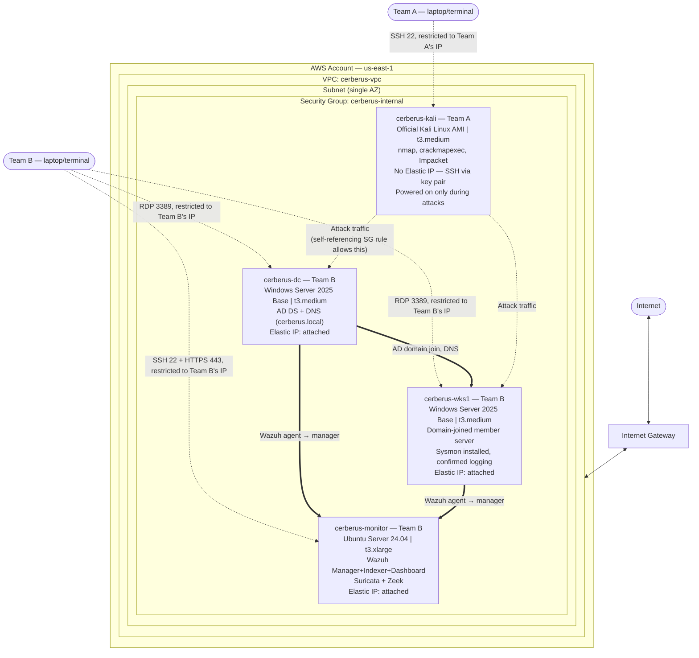
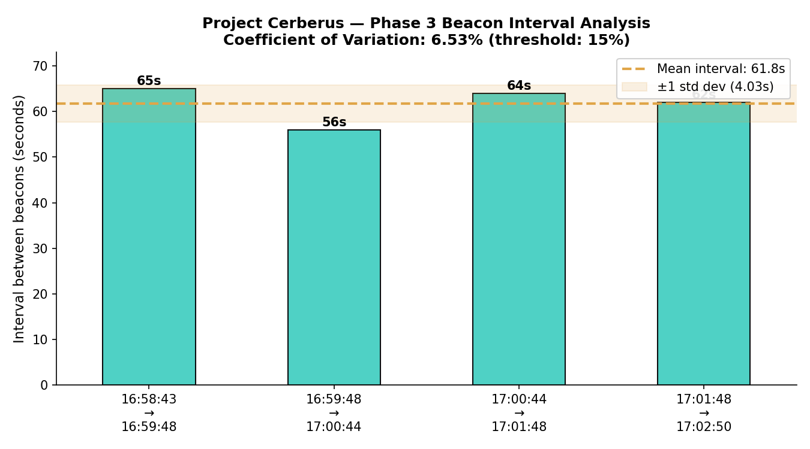

<div align="center">

# 🐺 Project Cerberus
### Ransomware Kill Chain Emulation & Detection Engineering

*Attack → Detect → Remediate → Verify — five phases, end to end, on real infrastructure*

[](#status)
[](LICENSE)
[](mitre-navigator-layer.json)
[](docs/09-incident-response-runbook.md)

[](diagrams/architecture.md)
[](rules/wazuh/local_rules.xml)
[](rules/suricata/local.rules)
[](scripts/beacon_jitter_check.py)
[](#the-five-phases)
[](docs/06-phase4-execution-log.md)
[](scripts/beacon_jitter_check.py)
[](scripts/collect_evidence.sh)

</div>

---

A CDAC PG-DITISS capstone project: a five-phase ransomware kill chain (modeled on the DarkSide/BlackCat-ALPHV operational pattern seen in the Colonial Pipeline incident) emulated end-to-end in an isolated AWS lab, paired with independently engineered, hand-written detection for every phase, mapped to MITRE ATT&CK.

This repo documents what we actually built and broke and fixed — not a sanitized "follow these 40 steps and nothing will ever go wrong" guide. Environments differ, tools update, and everyone's specific journey through a project like this looks a little different. What's here is ours: the real decisions, the real bugs, and the real reasoning behind every fix.

**Team A (Red Team / Attacker):** owns and operates the Kali instance.
**Team B (Blue Team):** owns and operates the Monitoring stack, Domain Controller, and Workstation.

## Contents

- [Why This Project Exists](#why-this-project-exists)
- [The Five Phases](#the-five-phases)
- [Full Attack Chain](#full-attack-chain)
- [Architecture](#architecture)
- [Sample Evidence](#sample-evidence)
- [What's in This Repo](#whats-in-this-repo)
- [How to Actually Use This Repo](#how-to-actually-use-this-repo)
- [Status](#status)
- [License](#license)

---

## Why This Project Exists

Real ransomware operations follow a structured, multi-stage lifecycle — initial access, credential theft, command-and-control, defense evasion, and data staging — not a single exploit. This project reproduces that structure deliberately, because the value here (both as a learning exercise and as a portfolio artifact) is demonstrating the full attacker lifecycle paired with matched, independently reasoned detection at every stage — not just running an attack and calling it done. The phases are also narratively connected, not independent exercises: Phase 1's compromised low-privilege account is the same account reused in Phase 2's Kerberoasting, mirroring how real intrusions chain techniques together.

## The Five Phases

| Phase | Red Team Action | MITRE ATT&CK | Blue Team Detection | Remediation | Result |
|---|---|---|---|---|---|
| 1. Initial Access | Password spray + port sweep | T1110 | Suricata + Wazuh correlation (Event 4625) | Account lockout, firewall block | ✅ Compromised `jsmith`; both defenses verified working on re-test |
| 2. Credential Theft | Kerberoasting | T1558.003 | Wazuh rule on RC4 ticket encryption | AES-only encryption enforced | ✅ Cracked in 19s; AES ticket confirmed uncrackable afterward |
| 3. C2 Beaconing | Low-jitter (10%) outbound heartbeat | T1071.001 | Zeek `conn.log` jitter analysis (6.53% CV) | Outbound firewall block | ✅ Beacon detected; blocked beacon confirmed failing at endpoint |
| 4. Defense Evasion | Base64-encoded PowerShell disabling Defender | T1059.001 | Wazuh rule on decoded Script Block Logging | Constrained Language Mode | ✅ Attack succeeded; remediation blocked even payload construction |
| 5. Data Staging | Password-protected 7-Zip archive from temp | T1560 | Wazuh rule: Sysmon archive-from-temp | Ticket revocation + endpoint isolation | ✅ Archive staged; full containment confirmed, evidence collected |

Full narrative, real issues hit, and screenshot evidence for each phase are linked below in [What's in This Repo](#whats-in-this-repo).

## Full Attack Chain

The five phases aren't independent exercises — Phase 1's compromised account is directly reused in Phase 2, and Phases 3–5 proceed as a single continuing post-exploitation sequence, mirroring how real ransomware operations actually chain techniques together.

```mermaid
graph TD
    Start(["Kill Chain Start"]) --> P1

    subgraph P1["Phase 1 — Initial Access · T1110"]
        direction TB
        A1["Team A: Password spray + port sweep<br/>netexec, nmap"]
        D1["Team B: Wazuh rule 100010<br/>+ Suricata sid:1000001"]
        R1["Remediation: Account lockout<br/>+ firewall block"]
        A1 --> D1 --> R1
    end

    subgraph P2["Phase 2 — Credential Theft · T1558.003"]
        direction TB
        A2["Team A: Kerberoast svc-sql<br/>Impacket + John the Ripper<br/>Cracked in 19s"]
        D2["Team B: Wazuh rule 100020<br/>RC4 ticket detection"]
        R2["Remediation: AES-only encryption<br/>enforced on account"]
        A2 --> D2 --> R2
    end

    subgraph P3["Phase 3 — C2 Beaconing · T1071.001"]
        direction TB
        A3["Team A: Low-jitter heartbeat<br/>60s ± 10%, to Monitor:443"]
        D3["Team B: Zeek conn.log<br/>jitter analysis — 6.53% CV"]
        R3["Remediation: Outbound<br/>firewall block"]
        A3 --> D3 --> R3
    end

    subgraph P4["Phase 4 — Defense Evasion · T1059.001"]
        direction TB
        A4["Team A: Base64-encoded PowerShell<br/>disables Defender real-time protection"]
        D4["Team B: Wazuh rule 100030<br/>decoded Script Block Logging (4104)"]
        R4["Remediation: Constrained<br/>Language Mode"]
        A4 --> D4 --> R4
    end

    subgraph P5["Phase 5 — Data Staging · T1560"]
        direction TB
        A5["Team A: Password-protected 7-Zip<br/>archive, staged in temp folder"]
        D5["Team B: Wazuh rule 100040<br/>Sysmon archive-from-temp detection"]
        R5["Remediation: Kerberos ticket<br/>revocation + endpoint isolation"]
        A5 --> D5 --> R5
    end

    P1 -->|"Compromised low-priv account<br/>(jsmith) carried forward"| P2
    P2 -->|"Foothold established"| P3
    P3 -->|"C2 channel active"| P4
    P4 -->|"Defenses weakened"| P5
    P5 --> End(["Incident Response Complete<br/>collect_evidence.sh executed"])
```



Full narrative on how the phases connect, plus a per-phase summary table, is in [`diagrams/attack-chain.md`](diagrams/attack-chain.md). The importable ATT&CK Navigator layer for all five techniques is [`mitre-navigator-layer.json`](mitre-navigator-layer.json).

## Architecture

Built entirely on AWS: a single VPC, one Security Group governing all internal and external traffic, four EC2 instances split across the two teams above.



Full reference details (IP scheme, Windows-client-on-EC2 licensing note, DHCP behavior) are in [`diagrams/architecture.md`](diagrams/architecture.md).

**Stack:** Kali Linux (attacker) · Windows Server 2025 (Domain Controller + workstation substitute) · Sysmon (SwiftOnSecurity config) · Wazuh 4.14.7 (SIEM) · Suricata 7.0.17 (network IDS) · Zeek 8.0 LTS (network security monitor) — entirely free/open-source, no paid tooling.

## Sample Evidence

Every phase has a full screenshot trail in [`docs/evidence/`](docs/evidence/) — 50 images across the project. As one example, Phase 3's beacon detection was validated statistically, not just by eye:

<div align="center">

</div>

*A simulated C2 beacon (60s base interval, ±10% jitter) measured at a 6.53% coefficient of variation — well under the project's 15% detection threshold. Full method and dataset in [`docs/08-jitter-beacon-analysis.md`](docs/08-jitter-beacon-analysis.md).*

## What's in This Repo

```
project-cerberus/
├── README.md                                   ← you are here
├── mitre-navigator-layer.json                  ← importable ATT&CK Navigator layer, all 5 phases
├── docs/
│   ├── 01-environment-build.md                 ← Day 1: full build log + every issue hit and how it was solved
│   ├── 02-phase1-phase2-implementation.md      ← Team A / Team B implementation guide, Phases 1–2
│   ├── 03-phase1-execution-log.md              ← Phase 1: real execution, issues, evidence
│   ├── 04-phase2-execution-log.md              ← Phase 2: real execution, issues, evidence
│   ├── 05-phase3-execution-log.md              ← Phase 3: real execution, issues, evidence
│   ├── 06-phase4-execution-log.md              ← Phase 4: real execution, issues, evidence
│   ├── 07-phase5-execution-log.md              ← Phase 5: real execution, issues, evidence
│   ├── 08-jitter-beacon-analysis.md            ← Phase 3 deep-dive: full dataset, chart, statistical method
│   ├── 09-incident-response-runbook.md         ← NIST SP 800-61 structured runbook, generalized from all 5 phases
│   └── evidence/                               ← screenshots referenced from the execution logs, organized per phase
├── diagrams/
│   ├── architecture.md                         ← infrastructure diagram
│   └── attack-chain.md                         ← full 5-phase attack-chain diagram
├── rules/
│   ├── suricata/local.rules                    ← custom Suricata detection rules
│   ├── wazuh/local_rules.xml                   ← custom Wazuh correlation rules (4 rules, one per Wazuh-detected phase)
│   └── sigma/                                  ← 5 hand-written Sigma rules, one per phase
└── scripts/
    ├── collect_evidence.sh                     ← IR evidence collection (process list, network state, auditd, services, cron)
    └── beacon_jitter_check.py                  ← Phase 3: standalone Zeek conn.log jitter/beacon analysis
```

## How to Actually Use This Repo

If you're trying to build something similar: read the docs in order (01 → 02 → 03...09), and expect your own journey to diverge from ours at some point — that's normal. The value of these logs isn't "do exactly this and nothing will break," it's "here's the actual reasoning behind diagnosing and fixing a real, specific class of problem," which transfers even when your specific error message looks different from ours.

If you're a reviewer/interviewer: the five execution logs (`03` through `07`) are where the real troubleshooting depth lives — each issue is documented with Symptom → Root Cause → Diagnosis Method → Fix → Why It Mattered. `09-incident-response-runbook.md` pulls the recurring lessons across all five phases into one place, which is a good starting point if you want the short version before diving into any one phase's full detail.

## Status

- [x] Environment build on AWS (VPC, Security Group, 4 instances)
- [x] Monitoring stack: Wazuh, Suricata, Zeek — deployed and verified end-to-end
- [x] Active Directory: Domain Controller + domain-joined workstation
- [x] Phase 1 — Initial Access: attacked, detected, remediated — [log](docs/03-phase1-execution-log.md)
- [x] Phase 2 — Credential Theft: attacked, cracked, remediated — [log](docs/04-phase2-execution-log.md)
- [x] Phase 3 — C2 Beaconing: attacked, detected (6.53% jitter), remediated — [log](docs/05-phase3-execution-log.md) · [analysis](docs/08-jitter-beacon-analysis.md)
- [x] Phase 4 — Defense Evasion: attacked, detected, remediated — [log](docs/06-phase4-execution-log.md)
- [x] Phase 5 — Data Staging: attacked, detected, remediated — [log](docs/07-phase5-execution-log.md)
- [x] Detection rule library (Suricata, Wazuh, 5 Sigma rules)
- [x] Bash IR evidence-collection script — run live as Phase 5's closing response action
- [x] Jitter/beacon-analysis writeup with supporting chart
- [x] MITRE ATT&CK Navigator layer export — [`mitre-navigator-layer.json`](mitre-navigator-layer.json)
- [x] Incident response runbook (NIST SP 800-61 structure) — [`09-incident-response-runbook.md`](docs/09-incident-response-runbook.md)

**All original project deliverables complete.**

## License

MIT — see [`LICENSE`](LICENSE).
