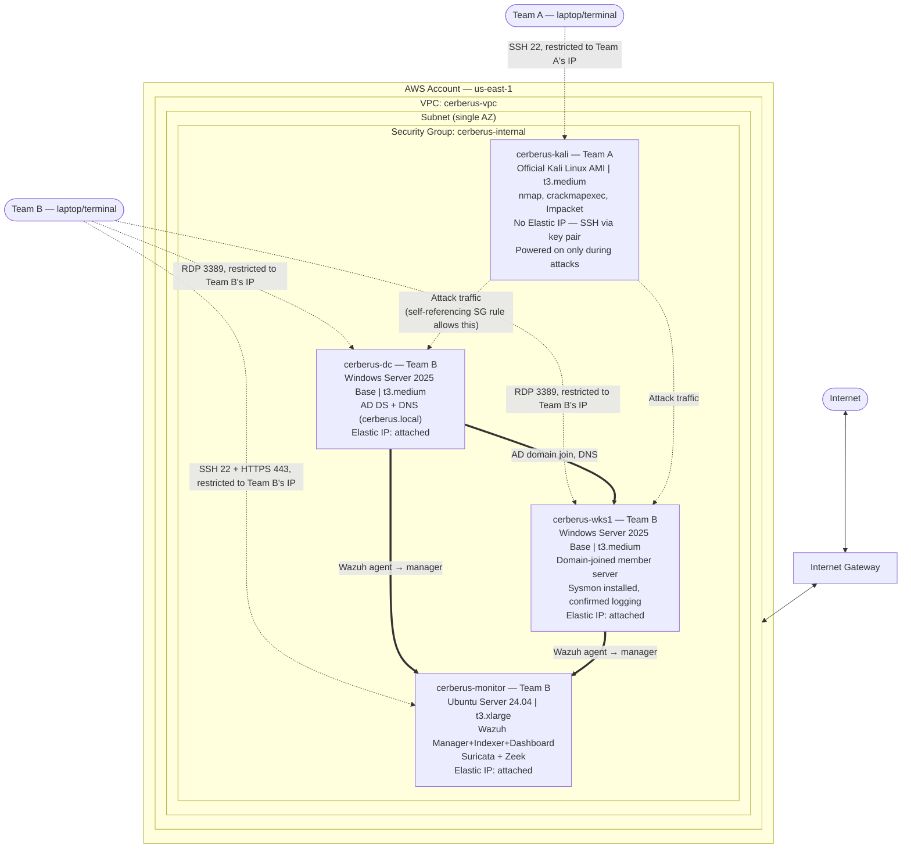

# Project Cerberus — Infrastructure Diagram

**Team A (Red Team / Attacker):** owns the Kali instance.
**Team B (Blue Team):** owns the Monitoring instance, Domain Controller, and Workstation.

---

### Reference details

| Field | Value |
|---|---|
| VPC CIDR | `10.0.0.0/16` |
| Subnet CIDR | `10.0.0.0/20` (confirm your own via VPC console — don't assume) |
| Security Group | `cerberus-internal` — self-referencing all-traffic rule for internal communication, plus SSH/RDP/HTTPS restricted to each team's own IP |
| DC private IP | fill in from console |
| Workstation private IP | fill in from console |
| Monitor private IP | fill in from console |
| Kali private IP | fill in from console (changes on stop/start — no Elastic IP) |

### Notes

- **Windows 10/11 client OS is not available on standard shared-tenancy EC2** (Microsoft licensing restricts it to Dedicated Hosts or WorkSpaces BYOL) — the Workstation runs Windows Server 2025 as a domain-joined member server instead. Functionally identical for every phase of this project.
- Each instance's private IP is persistent for the life of the instance — it does not change on stop/start, only on termination. Static IP configuration inside the OS is unnecessary; only DNS settings need manual adjustment (Workstation → DC, DC → itself).
