# Project Cerberus — Full Attack-Chain Diagram

Visual summary of all five phases, tying together the attack action, MITRE ATT&CK mapping, detection mechanism, and remediation for each. See [`mitre-navigator-layer.json`](../mitre-navigator-layer.json) for the importable ATT&CK Navigator layer, and [`architecture.md`](architecture.md) for the underlying infrastructure diagram.

```mermaid
graph TD
    Start(["Kill Chain Start"]) --> P1

    subgraph P1["Phase 1 — Initial Access · T1110"]
        direction TB
        A1["Team A: Password spray + port sweep<br/>netexec, nmap"]
        D1["Team B: Wazuh rule 100010<br/>+ Suricata sid:1000001"]
        R1["Remediation: Account lockout<br/>+ firewall block"]
        A1 --> D1 --> R1
    end

    subgraph P2["Phase 2 — Credential Theft · T1558.003"]
        direction TB
        A2["Team A: Kerberoast svc-sql<br/>Impacket + John the Ripper<br/>Cracked in 19s"]
        D2["Team B: Wazuh rule 100020<br/>RC4 ticket detection"]
        R2["Remediation: AES-only encryption<br/>enforced on account"]
        A2 --> D2 --> R2
    end

    subgraph P3["Phase 3 — C2 Beaconing · T1071.001"]
        direction TB
        A3["Team A: Low-jitter heartbeat<br/>60s ± 10%, to Monitor:443"]
        D3["Team B: Zeek conn.log<br/>jitter analysis — 6.53% CV"]
        R3["Remediation: Outbound<br/>firewall block"]
        A3 --> D3 --> R3
    end

    subgraph P4["Phase 4 — Defense Evasion · T1059.001"]
        direction TB
        A4["Team A: Base64-encoded PowerShell<br/>disables Defender real-time protection"]
        D4["Team B: Wazuh rule 100030<br/>decoded Script Block Logging (4104)"]
        R4["Remediation: Constrained<br/>Language Mode"]
        A4 --> D4 --> R4
    end

    subgraph P5["Phase 5 — Data Staging · T1560"]
        direction TB
        A5["Team A: Password-protected 7-Zip<br/>archive, staged in temp folder"]
        D5["Team B: Wazuh rule 100040<br/>Sysmon archive-from-temp detection"]
        R5["Remediation: Kerberos ticket<br/>revocation + endpoint isolation"]
        A5 --> D5 --> R5
    end

    P1 -->|"Compromised low-priv account<br/>(jsmith) carried forward"| P2
    P2 -->|"Foothold established"| P3
    P3 -->|"C2 channel active"| P4
    P4 -->|"Defenses weakened"| P5
    P5 --> End(["Incident Response Complete<br/>collect_evidence.sh executed"])
```

---

## Phase-to-Phase Narrative Continuity

Unlike five independent exercises, this project's phases connect into a single coherent story, mirroring how real ransomware operations chain techniques together:

1. **Phase 1's** successful password spray compromised the `jsmith` account — a genuinely low-privilege credential.
2. **Phase 2** reused that same compromised account to perform Kerberoasting, since the technique only requires *any* authenticated domain user, not administrative rights — directly demonstrating why even a "minor" low-privilege compromise in Phase 1 has real downstream consequences.
3. **Phase 3, 4, and 5** proceed as a simulated compromised endpoint (the Workstation) continuing post-exploitation activity: establishing C2, disabling defenses, and staging data for exfiltration — the standard progression in a ransomware precursor operation.

This continuity is also why Phase 2's setup required deliberately removing a leftover Phase 1 firewall rule before proceeding (documented in [`../docs/04-phase2-execution-log.md`](../docs/04-phase2-execution-log.md)) — the phases genuinely build on a shared, evolving environment state, not a reset-each-time lab exercise.

## Summary Table

| Phase | Technique | Tactic | Detection | Remediation | Status |
|---|---|---|---|---|---|
| 1 | T1110 | Credential Access | Wazuh 100010 + Suricata | Account lockout + firewall block | ✅ Complete |
| 2 | T1558.003 | Credential Access | Wazuh 100020 | AES-only encryption | ✅ Complete |
| 3 | T1071.001 | Command and Control | Zeek jitter analysis | Outbound firewall block | ✅ Complete |
| 4 | T1059.001 | Execution | Wazuh 100030 | Constrained Language Mode | ✅ Complete |
| 5 | T1560 | Collection | Wazuh 100040 | Ticket revocation + isolation | ✅ Complete |
